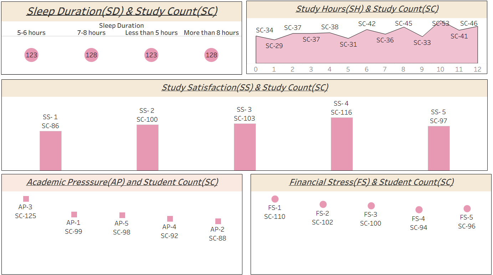

# 📊 Student Depression Analysis Dashboard

## 📌 Project Overview

This project analyzes student depression data using Tableau to identify key patterns, risk factors, and trends affecting mental health.

## 🎯 Objectives

* Understand factors contributing to student depression
* Identify high-risk groups
* Visualize mental health trends

## 🔧 Tools Used

* Tableau
* Excel / CSV

## 📊 Key Insights

* Relationship between academic pressure and depression levels
* Impact of sleep patterns on mental health
* Gender-wise and age-wise analysis
* Lifestyle factors affecting student well-being

## 📷 Dashboard Preview

## 📁 Files Included

* Student_Depression_Dashboard.twbx
* dataset.csv

## 🚀 How to Use

Download the `.twbx` file and open it in Tableau Desktop to explore the dashboard.

## 📌 Conclusion

The dashboard provides insights into student mental health and highlights key areas where intervention and awareness can help reduce depression levels.
